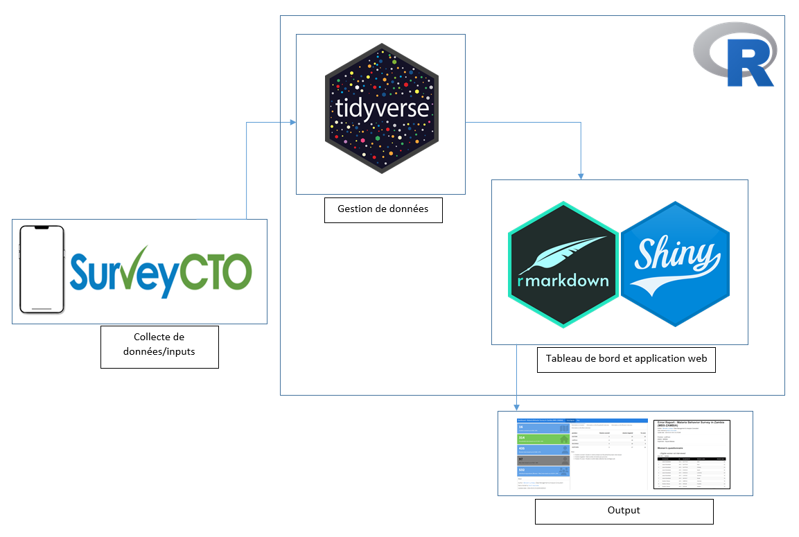

Mbote !

## Intro...

Lors de notre [précédant post](https://bervelin-lumesa.netlify.app/post/collecte-de-donn-es-mobile-partage-d-exp-rience/), nous avons parlé de la collecte de données mobile. Il était question des étapes et des conseils pratiques pour partir du questionnaire papier à la création du formulaire électronique. Mais que se passe-t-il lorsque la collecte demarre ? Comment informer les parties prénantes de l'évolution des activités ? Comment faire le feedback aux équipes de terrain ? Nous allons essayer de répondre à ces questions à nous mettant à la place du gestionnaire de données ou data manager

## Importance du suivi de la collecte de données 

Le suivi des activités de la collecte de données est crucial pour plusieurs raisons, en particulier dans les projets de recherche, d'évaluation ou d'analyse. Voici quelques raisons qui montrent l'importance de ce suivi :

1.  Assurer la qualité des données

    Le suivi permet de s'assurer que les données collectées respectent les normes de qualité prédéfinies (exhaustivité, exactitude, cohérence). Cela garantit que les erreurs et les biais sont minimisés dès le début du processus. Il aide également à identifier rapidement les problèmes de collecte (comme des erreurs de saisie, des données manquantes ou des erreurs d'échantillonnage) qui pourraient affecter les résultats finaux.

2.  Surveillance de l'avancement

    Le suivi permet de surveiller l'avancement des activités de collecte de données en temps réel. Cela permet de s'assurer que les délais sont respectés et que l'ensemble des données est collecté dans le temps imparti. Si des retards sont observés, des ajustements peuvent être apportés rapidement pour éviter des impacts négatifs sur les échéances globales du projet.

3.  Optimisation des ressources

    En suivant les activités de collecte, il est possible de mieux gérer les ressources (humaines, financières, matérielles) allouées. Cela garantit que les équipes de terrain travaillent efficacement et que les outils de collecte (questionnaires, outils numériques, etc.) sont bien utilisés. Le suivi aide également à éviter le gaspillage de ressources en détectant les inefficacités et en réajustant les processus.

4.  Détection et résolution des problèmes

    Pendant la collecte de données, il peut y avoir des problèmes imprévus, comme des erreurs de saisie, ou de choix de réponses ou d'autres erreurs humaines. Un bon suivi permet de détecter ces problèmes rapidement et de trouver des solutions appropriées avant qu'ils n'affectent gravement la qualité ou la quantité des données collectées.

5.  Amélioration de la transparence et de la responsabilité

    Le suivi régulier des activités de collecte de données améliore la transparence des processus et permet de rendre des comptes aux parties prenantes (bailleurs de fonds, équipes de recherche, etc.). Cela montre que les méthodologies suivies sont rigoureuses et que le projet respecte les normes éthiques et les attentes.

6.  Vérification de la conformité aux plans de collecte

    Les projets de collecte de données ont souvent des protocoles rigoureux sur la manière dont les informations doivent être recueillies (échantillonnage, méthodes de collecte, consentement éclairé, etc.). Le suivi permet de s'assurer que ces plans sont respectés et que les écarts sont rapidement corrigés.

7.  Faciliter les ajustements en temps réel

    Le suivi permet d'ajuster les stratégies de collecte de données au fur et à mesure. Si des problèmes spécifiques ou des changements contextuels surviennent (par exemple, des difficultés à accéder à certaines régions ou populations), des ajustements peuvent être faits pour maintenir la rigueur de la collecte sans compromettre les résultats.

## Outils de suivi de la collecte de données

Pour le suivi visuel et la gestion des données collectées, des outils de visualisation et d'analyse sont souvent utilisés pour vérifier la qualité et suivre l'avancement.

-   Tableau : Un outil puissant pour visualiser les données collectées en temps réel. Il permet de créer des tableaux de bord interactifs qui montrent l'avancement de la collecte de données et identifient les écarts ou problèmes.

-   Power BI : Semblable à Tableau, cet outil de Microsoft permet de créer des visualisations en temps réel à partir des données collectées et de partager ces rapports avec les équipes.

-   R : Un excellent outil pour le suivi et l'analyse des activités de collecte de données, notamment grâce à ses bibliothèques puissantes pour la manipulation de données, la visualisation et l'analyse statistique.

## Mes outils..

Personnellement, j'utilise R parce qu'il me permet de faire un travail reproductible. Un même script peut ête modifié legèrement pour s'adapter à un autre projet. De plus, avec un langage de programmation les possibilités sont infinies.

Avant de générer des rapports d'avancement, on a souvent besoin de faire un néttoyage rapide de données avant de calculer les indicateurs et R dispose d'excellents packages pour ces tâches.

Pour la plus part de projets, j'utilise R pour le nettoyage continue durant la collecte avec les packages `dplyr`, `tidyr`et `lubridate`. `Rmarkdown`, `flexdashboard` et `shiny` pour la création des rapports automatiques, des tableaux de bords et applications web

Avec tout cela en place, il suffit juste d'appuyer sur un bouton pour générer les rapports à envoyer aux parties prénantes (équipes de terrain et coordination) pour des actions.

Mon flux de travail durant la collecte de données ressemble à peu près à l'image ci-après, où SurveyCTO peut être remplacé par d'autres outils comme ODK ou KoboToolbox.

Dans tous les cas, il faut éviter des tâches répétitives telles que le la contruction des tableaux, le calcul des indicateurs ou la mise en forme du rapport. Grâce à un langage de programmation comme R, tout cela peut être automatisé.

## Choix des indicateurs

Le choix des indicateurs ou des métriques à inclure dans le tableau de bord ou le rapport dépend du besoin en information. Qu'a-t-on besoin de mesurer et de suivre ?

Pour ma part je crée toujours deux type de rapports : un rapport d'avancement qui donne une idée sur la progression de la collecte de données (nombre de ménages enquêtés, nombre de réfus, etc.) et un rapport d'erreurs. Celui-ci liste les différentes erreurs commises par les enquêteurs. Il peut s'agir des doublons, des valeurs extrêmes (une personne de plus de 18 ans qui fréquente encore l'école primaire) ou toute autre incohérence dans le données. La création du rapport d'erreurs nécessite d'avoir une connaissance approfondi du(des) questionnaire(s) et des liens qui existent entre différentes unités statistiques.

#### Besoin d'un expert pour appuyer votre projet de collecte de données ? [Contactez-moi! Je suis là pour vous accompagner.](mailto:lumesabervelin@gmail.com)

 

## Avez-vous trouvé cet article utile ? Pensez à le partager 🙌

