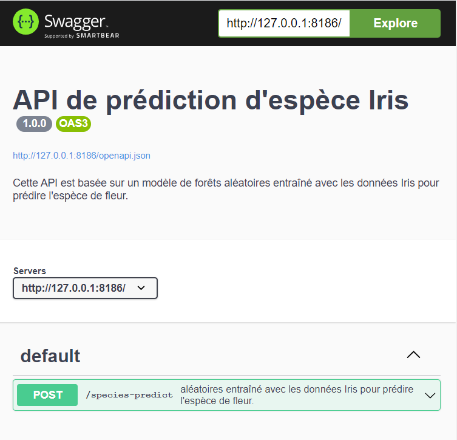
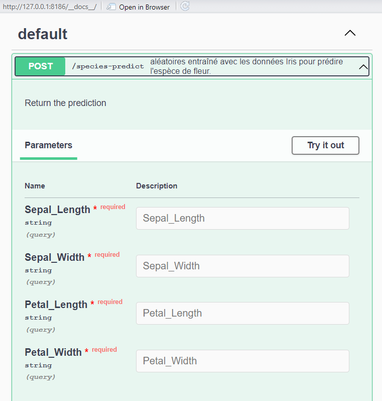
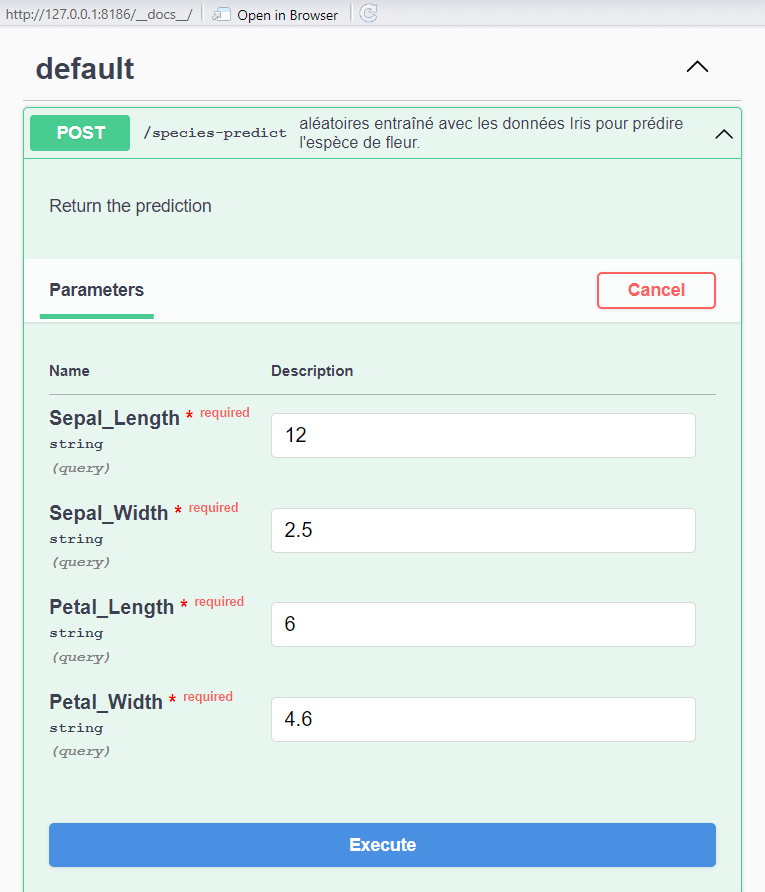
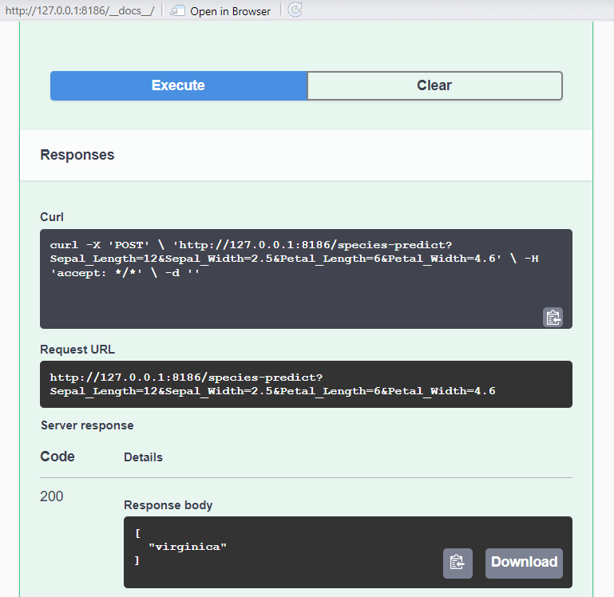

Mbote!

## Introduction

Dans cet article, nous allons explorer comment déployer un modèle de machine learning sous forme d'API à l'aide de plumber, un package R simple et puissant. De plus en plus de projets de machine learning passent de simples expérimentations en laboratoire à des solutions robustes et prêtes pour la production. Cela nécessite une intégration fluide entre les modèles et les systèmes existants, souvent via une interface de programmation d'application (API). Cette première partie vous guidera à dans la conception de l'API. Dans la seconde partie, nous verrons comment faire appel à l'API au sein d'une application Rshiny.

## C'est quoi une API

Une API (Application Programming Interface) est une interface qui permet à des logiciels différents de communiquer entre eux. Dans le cadre du développement web ou logiciel, une API permet à une application de demander des données ou des services à une autre application, souvent via des requêtes HTTP. L'API reçoit une requête, effectue le traitement nécessaire (qui peut inclure la validation, la récupération ou le calcul des données), et renvoie une réponse au format approprié, souvent en JSON ou XML.

### API en Machine Learning

Dans le contexte du machine learning, une API permet d'exposer un modèle d'apprentissage automatique pour qu'il puisse être utilisé par des systèmes externes. Cela signifie que plutôt que de charger un modèle localement à chaque fois que tu veux l'utiliser, tu le rends accessible via une API. Les applications peuvent alors envoyer des données à l'API, qui fait des prédictions ou des classifications en temps réel et renvoie les résultats.

Par exemple, tu peux déployer un modèle de prédiction des prix immobiliers. Une API permettrait à une application externe (comme un site web ou une application mobile) d'envoyer des caractéristiques d'un bien immobilier (surface, nombre de chambres, localisation) et de recevoir instantanément une estimation de son prix grâce au modèle.

### Avantage d'une API en Machine Learning

1.  Accès centralisé : Une API permet de rendre un modèle accessible à plusieurs utilisateurs ou systèmes, sans qu'ils aient besoin d'avoir accès au code source du modèle ou de savoir comment il fonctionne en interne.

2.  Mise à jour facile : Lorsqu'un modèle est amélioré, il suffit de le redéployer via l'API. Toutes les applications utilisant l'API auront immédiatement accès à la version la plus récente du modèle.

3.  Scalabilité : Une API peut gérer des requêtes simultanées venant de multiples utilisateurs, ce qui permet de faire évoluer ton modèle pour répondre à une demande croissante.

4.  Séparation des responsabilités : En séparant la logique du modèle des applications clientes, il devient plus facile de maintenir et de mettre à jour les deux indépendamment. Les développeurs peuvent se concentrer sur l'amélioration des performances du modèle, tandis que les développeurs front-end peuvent se concentrer sur l'interface utilisateur.

5.  Interopérabilité : Grâce à une API, ton modèle peut être utilisé dans des environnements variés (applications web, applications mobiles, autres services logiciels), indépendamment des langages ou des technologies utilisées par ces systèmes.

## Création d'une API avec plumber

Dans ce qui suit, nous allons voir étape par étape la construction de notre API. Que fera donc notre API ? L'API que nous créons va consister à faire la classification d'espèce de fleurs Iris. On parle de classification lorsque la variable d'intérêt est catégorielle, "setosa", "versicolor" et "virginica" pour notre cas. Nous allons utiliser les variables numériques comme prédicteurs : "Sepal.Length", "Sepal.Width", "Petal.Length" et "Petal.Width". Pour plus d'infos sur fichier de données, taper `?iris` sur la console R.

### Avant de commencer : le modèle est-il prêt ?

Avant de déployer votre modèle, vous devez vous assurer qu'il a été bien entrainé et qu'il est prêt pour le déploiement. Dans le cadre de cet article, nous ne verrons pas le processus de création de notre modèle. Mais il est important de savoir que nous avons utilisé un modèle de forêts aléatoires du package `randomForest` et la fonction du même nom pour prédire l'espèce de fleur.

### Création de l'API

Une API plumber est simplement un script R avec des commentaires spéciaux (#\*).

Pour commencer, créez un script R et nommez-le plumber (vous pourrez choisir un autre nom pour vos projets). Dans ce script, nous allons ajouter des lignes de code au fur et à mesure qu'on avance.

#### 1. Chargement des bibliothèques

Commencez par charger les packages. S'ils ne sont pas encore installés, faites `intall.packages("nom_du_package")` pour installer.

``` r
# Chargement des packages
library(plumber)
library(randomForest)
```

Ces lignes chargent les bibliothèques `plumber` et `randomForest`. `plumber` est utilisé pour créer l'API, tandis que `randomForest` est utilisé pour charger et utiliser le modèle prédictif.

#### 2. Chargement du modèle

``` r
# Chargement du modèle
model <- readRDS("rand_forest.rds")
```

Cette ligne charge un modèle Random Forest préalablement entraîné à partir d'un fichier RDS. Le modèle est ensuite stocké dans la variable model. [Vous pouvez téléchager ce fichier à partir d'ici](https://github.com/bervelin-lumesa/plumber_shiny).

#### 3. Documentation de l'API

``` r
#* @apiTitle Species prediction API
#* @apiDescription This API is based on Iris Data and uses characteristics such as Sepal.Length, Petal.Width to predict Species 
```

Ces lignes sont des commentaires spéciaux utilisés par `plumber` pour documenter l'API. \@apiTitle et \@apiDescription fournissent le titre et la description de l'API.

#### 4. Définition des paramètres de l'API

Avant que notre modèle fasse une prédiction, il doit récevoir une entrée constituée des valeurs des variables prédictrices. Elles seront passées au modèle sous forme de paramètres.

``` r
#* @param Sepal_Length
#* @param Sepal_Width
#* @param Petal_Length
#* @param Petal_Width
```

Ces lignes définissent les paramètres que l'API attend dans la requête POST. Chaque paramètre représente une caractéristique des fleurs Iris.

#### 5. Route de prédiction de l'API

Les lignes suivantes définissent une fonction qui qui réalise la prédiction.

``` r
#* @post /species-predict
function(Sepal_Length, Sepal_Width, Petal_Length, Petal_Width) {
  df <- data.frame(
    Sepal.Length = as.numeric(Sepal_Length),
    Sepal.Width  = as.numeric(Sepal_Width),
    Petal.Length = as.numeric(Petal_Length),
    Petal.Width  = as.numeric(Petal_Width)
  )
  predict(model, newdata = df)
}
```

-   Route de l'API (\@post /species-predict) : Définit une route POST à l'URL /species-predict pour la prédiction des espèces. La route POST permet d'envoyer les données au serveur (par exemple soumettre un formulaire) et d'obtenir une réponse.

-   Fonction de prédiction : La fonction prend les paramètres Sepal_Length, Sepal_Width, Petal_Length et Petal_Width de la requête POST, crée un data.frame avec ces valeurs, puis utilise le modèle pour prédire l'espèce de la fleur.

A part la route POST, il en existe d'autres comme GET, DETELE etc.

Le code complet est :

``` r
library(plumber)
library(randomForest)

model <- readRDS("rand_forest.rds")

#* @apiTitle API de prédiction d'espèce Iris
#* @apiDescription Cette API est basée sur un modèle de forêts 
#* aléatoires entraîné avec les données Iris pour prédire l'espèce de fleur. 

#* Return the prediction
#* @param Sepal_Length
#* @param Sepal_Width
#* @param Petal_Length
#* @param Petal_Width

#* @post /species-predict
function(Sepal_Length, Sepal_Width, Petal_Length, Petal_Width){
  
  df <- data.frame(
    Sepal.Length = as.numeric(Sepal_Length),
    Sepal.Width  = as.numeric(Sepal_Width),
    Petal.Length = as.numeric(Petal_Length),
    Petal.Width  = as.numeric(Petal_Width)
  )
  
  predict(model, newdata = df)
  
}
```

#### 6. Tester l'API

Pour lancer l'application, il suffit de cliquer sur Run API de votre script R. Vous obtiendrez alors l'image ci-apris :



Pour accéder à la route POST où se trouve notre modèle, cliquez sur POST. Cela affiche les différents paramètres d'entré du modèle. Pour povoir introduire les valeurs de chaque paramètres, il suffit de cliquer sur "Try it out".



L'image ci-après donne un exemple de remplissage pour chaque paramètre. Après remplissage, cliquez sur "Execute" pour obtenir la prédiction.



L'image ci-après donne la prédiction du modèle en fonction des valeurs introduites dans l'image précédente. On peut voir sur l'image que nous avons obtenu le code 200, qui correspond à la réussite de notre réquête et l'espèce prédite "virginica" dans "Response body".



#### 7. Déploiement de l'API

Dans le cadre de cet article, nous allons nous limiter au déploiement en local et nous fournirons des pistes de solutions pour le déploiement dans le cloud.

##### 7.1. En local

Comme vous l'aurez remarquer, le port (les quatre chiffres après : dans l'URL) de l'API n'est pas fixe, mais peut se modifier du fil d'exécution. R a la solution à cela.

Créez un autre script R et y ajoutez les commandes suivantes :

```r
pr <- plumber::plumb("plumber.R")
pr$run(port = 8000)
```
Ces lignes permettent d'exécuter notre API à partir d'un autre script et de fixer le port. 
Vous pouvez alors lancer votre API, de préférence en arrière-plan, à l'aide "Background Jobs"" de Rstudio. Cela permet de faire tourner l'API sans paralyser la session en cours. Pour ce faire, cliquez sur "Source" puis "Source as Background Jobs" au coin supérieur droit de votre script. Vous pouvez alors accès à l'API via `http://127.0.1.1:8000/__docs__/`

##### 7.2. Dans le cloud

Il existe plusieurs possibilités pour déployer l'API `plumber` dans le cloud. Ci-après quelques solutions: 

- [Posit Connect](https://docs.posit.co/connect/how-to/publish-plumber-api/)

Posit Connect (anciennement connu sous le nom de RStudio Connect) est une plateforme de publication et de gestion développée par Posit (anciennement RStudio) qui permet de déployer, partager et gérer des applications et des documents produits avec des outils R et Python. Elle est conçue pour rendre le processus de déploiement et de collaboration simple et efficace pour les data scientists, analystes et développeurs.


- [Digital Ocean](https://datawookie.dev/blog/2017/06/deploying-a-minimal-plumber-api-on-digitalocean/)

DigitalOcean est une plateforme de cloud computing qui fournit des services d'hébergement et d'infrastructure cloud pour les développeurs, les petites et moyennes entreprises, ainsi que les startups. DigitalOcean est populaire pour son approche simple et conviviale, offrant des solutions accessibles pour les personnes qui veulent créer et gérer des applications sur des serveurs cloud, sans la complexité de certaines plateformes plus massives comme AWS ou Google Cloud Platform.

- [Saturn cloud](https://saturncloud.io/docs/examples/r/production/qs-r-api/)

Saturn Cloud est une plateforme cloud qui fournit des environnements pour le développement, le déploiement et la gestion de projets en data science et machine learning à grande échelle. Elle offre des outils et des ressources pour faciliter le travail des data scientists et des ingénieurs machine learning, en leur permettant de construire, entraîner et déployer des modèles efficacement.


## Conclusion

**Conclusion**

Dans cette première partie, nous avons exploré les bases de la création d'une API en utilisant `plumber` dans R pour exposer un modèle de machine learning. Nous avons vu comment une API permet de rendre un modèle accessible, offrant ainsi une interface simple pour des applications externes. À travers l'exemple du modèle de classification Iris, nous avons couvert les étapes clés, depuis la préparation du modèle jusqu'à la création et le test de l'API en local.

La mise en place d'une API permet non seulement de centraliser les accès à un modèle, mais aussi d'améliorer la scalabilité et de faciliter les mises à jour. Dans la prochaine partie, nous nous intéresserons à l'intégration de cette API dans une application `Rshiny`, ce qui permettra de démontrer la synergie entre des modèles prédictifs et des interfaces utilisateurs interactives.

Que ce soit pour des déploiements en local ou dans le cloud, l'intégration des modèles machine learning via des API est une étape essentielle pour rendre ces modèles réellement opérationnels en production.

Tous les codes peuvent être trouvés ici dans mon [Github](https://github.com/bervelin-lumesa/plumber_shiny)  

## Avez-vous trouvé cet article utile ? Pensez à le partager 🙌

---
Voici la suite de cet article : [Déployer son modèle de Machine Learning sous forme d''API plumber dans R :
  Part. 2]()
  
