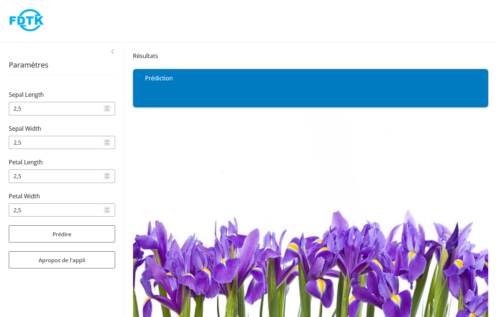
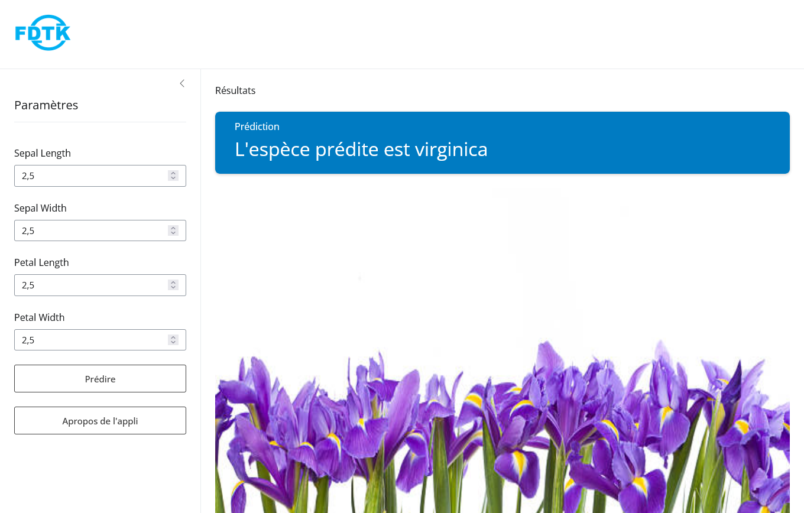

Mbote !

## Introduction

Dans le développement d'applications interactives, la combinaison de RShiny et Plumber se révèle être une solution puissante. RShiny permet de créer des interfaces utilisateurs dynamiques pour visualiser et manipuler des données, tandis que Plumber facilite l'exposition des modèles et des analyses sous forme d'API. En intégrant une API Plumber dans RShiny, on peut enrichir une application avec des fonctionnalités avancées, notamment le déploiement de modèles de machine learning ou l'accès à des services de données externes. Dans cet article, nous verrons comment mettre en place cette intégration pour créer une application flexible.

Retrouvez la première partie de cet article : [Déployer son modèle de Machine Learning sous forme d''API plumber dans R :
  Part. 1](https://bervelin-lumesa.netlify.app/post/deployer-son-modele-de-machine-learning-sous-forme-d-api-plumber-dans-r-part-1/)
  
### Shiny

[Shiny](https://shiny.posit.co/) est un package de R (et python) développé par posit qui permet de créer facilement des applications web interactives sans avoir besoin de maîtriser des langages comme HTML, CSS ou JavaScript. Avec Shiny, les utilisateurs peuvent transformer leurs analyses et visualisations en applications web dynamiques, offrant aux utilisateurs finaux une interface intuitive pour explorer les données, tester différents paramètres ou afficher des résultats en temps réel.

## Conception de l'application web

### Avant d'ouvrir R : sur papier d'abord

Avant de lancer Rstudio pour commencer le codage de notre application, il est important de reféchir sur son architecture. De même que la construction d'une maison commence sur un papier (plan), il est avantageux pour le développeur d'avoir une idée claire de son futur produit.

Pour notre cas, voici les points importants de notre application :

- L'application reçoit les inputs de l'utilisateur à l'aide d'un formulaire;
- L'utilisateur clique sur un bouton pour demander la prédiction;
- L'application se connecte à l'API, effectue le calcul avec les inputs de l'utilisateur et returne la prédiction;
- L'utilisateur peut cliquer sur un autre bouton pour avoir des infos sur l'application.


**Commençons maintenant !**

Une application shiny comprend trois parties : l'interface utilisateur ou le front-end (ce que l'utilisateur voit), le serveur ou le back-end (où s'effectue les calculs) et une fonction qui rassemble les deux parties précédentes. 

### Interface Utilisateur

Dans notre interface utilisateur, nous allons avoir des champs pour introduire les valeurs dont notre API a besoin pour nous renvoyer la prédiction. Nous aurons aussi deux boutons: un pour demander la prédiction et l'autre pour afficher les informations sur l'application. 

#### Téléchargement des packages


``` r
library(shiny)
library(bslib)
library(httr)
library(jsonlite)
```

#### Définir l'Interface Utilisateur


```r
ui <- page_sidebar(
  theme = bs_theme(version = 5),
  title = tags$a(href = "", tags$image(src = "fdtk.png", height = "100px")),
  sidebar = sidebar(
    title = "Paramètres",
    width = "25%",
    
    # les différents paramètres (inputs)
    numericInput(inputId = "sl", label = "Sepal Length", min = 0, max = 10, value = 2.5, step = 0.5),
    numericInput(inputId = "sw", label = "Sepal Width", min = 0, max = 10, value = 2.5, step = 0.5),
    numericInput(inputId = "pl", label = "Petal Length", min = 0, max = 10, value = 2.5, step = 0.5),
    numericInput(inputId = "pw", label = "Petal Width", min = 0, max = 10, value = 2.5, step = 0.5),
    
    actionButton(inputId = "run", label = "Prédire"),
    actionButton(inputId = "about", label = "Apropos de l'appli")
  ),
  "Résultats",
  layout_columns(
    row_heights = c(1, 5),
    col_widths = c(12,12),
    value_box(
      title = "Prédiction",
      # afficher la prediction
      value = textOutput("pred"),
      theme = "primary"
    ),
    
      imageOutput("img")
  )
)

```

### Serveur

Le serveur contient entre autre une fonction permettant d'envoyer la requête à l'API et de récupérer la prédiction.

```r
server <- function(input, output) {
  
  observeEvent(input$run, {
    output$pred <- renderText({
      # Appel à l'API en local
      base_url <- "http://127.0.1.1:8000/species-predict"
      arg <- list(
        Sepal_Length = isolate(input$sl), 
        Sepal_Width  = isolate(input$sw), 
        Petal_Length = isolate(input$pl), 
        Petal_Width  = isolate(input$pw)
      )
      
      # Envoi de la requête et récupération de la réponse
      query_url <- modify_url(url = base_url, query = arg)
      resp <- POST(query_url)
      resp_raw <- content(resp, as = "text", encoding = "utf-8")
      response <- fromJSON(resp_raw)
      
      return(paste0("L'espèce prédite est ", response))
    })
  })
  
  # Afficher la fleur
  output$img <- renderImage({
    list(src = "www/flowers.jpg",
         width = "100%",
         height = "160%",
         alt = "Bervelin")
  }, deleteFile = F)
  
  # Afficher la boite "A propos"
  observeEvent(input$about, {
    showModal(modalDialog(
      title = "À propos",
      "Cette application utilise un modèle de forêts aléatoires déployé avec l'API",
      a(href = "https://rplumber.io", target = "_blank", "plumber"), ".",
      "À chaque prédiction, l'application envoie une requête à l'API qui retourne une réponse sous forme de chaîne de caractères contenant la classe prédite (setosa, virginica ou versicolor)", hr(),
      "Bervelin Lumesa", "Statisticien/Data Scientist", br(),
      a(href = "https://www.linkedin.com/in/bervelin-lumesa/", target = "_blank", "Profil Linkedin"), br(),
      a(href = "https://bervelin-lumesa.netlify.app", target = "_blank", "Site web")
    ))
  })
  
}

```

Cette fonction permet de mettre ensemble l'interface utilisateur et le serveur pour constituer notre application. 

```r
shinyApp(ui, server)
```

### Tester l'application

Pour tester cette application en local avec l'API, il faut lancer cette dernière en arrière-plan avec "Backgroud jobs". L'application Shiny peut être exécutée en arrière-plan ou pas. Vous obtiendrez les résultats comme sur les images ci-dessous :



En cliquant sur "Prédire", l'application affiche la prédiction, ici "virginica".



### Conclusion

Nous avons vu comment il est possible de faire appel à l'API (plumber) au sein d'une application shiny, d'envoyer une requête et de récupérer une prédiction. Cela dit, peu importe le langage dans lequel votre modèle est développé, shiny peut l'utiliser sans problème s'il est déployé sous forme d'API. 

Tous les codes peuvent être trouvés ici dans mon [Github](https://github.com/bervelin-lumesa/plumber_shiny)  


## Avez-vous trouvé cet article utile ? Pensez à le partager 🙌
